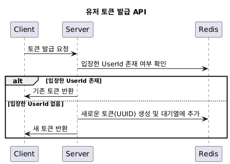

# 콘서트 예약 서비스

## 프로젝트 Milestone
### ManHour: 16시간
| 요일  | 시간  |
|-----|-----|
| 토요일 | 4시간 |
| 일요일 | 4시간 |
| 월요일 | 2시간 |
| 화요일 | 2시간 |
| 수요일 | 2시간 |
| 목요일 | 2시간 |

---

### 1주차
| 작업          | 시간  |
|-------------|-----|
| 요구사항 분석     | 4시간 |
| 시퀀스 다이어그램   | 3시간 |
| ERD         | 6시간 |
| API 명세 작성   | 2시간 |
| Mock API 생성 | 1시간 |

---

### 2주차
| 작업              | 시간    |
|-----------------|-------|
| 대기열 기능 구현       | 6시간   |
| 유저 토큰 발급 API    | 1.5시간 |
| 예약 가능 날짜/좌석 API | 1시간   |
| 좌석 예약 요청 API    | 2시간   |
| 잔액 충전/조회 API    | 1시간   |
| 결제 API          | 4.5시간 |

---

### 3주차
| 작업              | 시간    |
|-----------------|-------|
| 대기열 기능 고도화      | 6시간   |
| 5분 임시 배정 기능 고도화 | 3시간   |
| 코드 리팩터링         | 2시간   |
| CI/CD 구성 및 배포   | 1.5시간 |
| QA              | 1.5시간 |
| 보고서 작성          | 2시간   |

---

## 대기열 기능

서버에서 내부적으로 n초마다 m명의 유저를 입장시키는 방식
- 입장 : Redis 대기열에 있는 m명의 유저를 꺼내서 해당 유저의 토큰을 활성화

**Redis : SortedSet 활용**

대기열 추가 / 대기열 제거 / 특정 요소의 순번 조회 : O(log(n))

Score에 유저의 대기열 진입 시간을 넣어서 조금 더 빨리 진입한 유저에 대해 높은 우선순위 부여 가능


### 유저 토큰 발급 API


**회원가입을 진행한 유저만 해당 기능을 사용할 수 있게 구현할 예정**

1. 유저(userId)가 토큰 발급 API를 요청
2. 해당 userId로 입장한 토큰이 있는지 Redis 조회
- `Key = AllowUser:${userId}, Value = 토큰(uuid)`
3. key에 해당하는 값이 존재한다면 해당 유저는 이미 입장을 한 유저이므로 토큰을 그대로 리턴
4. key에 해당하는 값이 없다면 토큰 생성 후 Redis 대기열에 추가
- 이 때 토큰은 발급 시점으로 부터 `n분 후 만료`된다.

### API Spec

#### Request
`POST /token/:userId`

#### Response
```json
// 200 OK
{
  "token" : "155b6bfa-d542-4001-8a70-c86adde969af"
}
```

### 예약 가능 날짜 API

#### Request
`GET /concert/:conertId/available-times`
```json
// header
{
  "x-queue-token" : "155b6bfa-d542-4001-8a70-c86adde969af"
}
```

#### Response
```json
// 200 OK
{
  "concertId" : 1,
  "concertName" : "레미제라블",
  "concertDate" : [
    {
      "startDate" : "2024-12-01 09:00",
      "endDate" : "2024-12-01 11:00"
    },
    {
      "startDate" : "2024-12-01 12:00",
      "endDate" : "2024-12-01 14:00"
    }
  ]
}
```

### 예약 가능 좌석 API

#### Request
`GET /concert/:conertId/available-seats?startDate=${startDate}`
```json
// header
{
  "x-queue-token" : "155b6bfa-d542-4001-8a70-c86adde969af"
}
```

#### Response
```json
// 200 OK
{
  "concertId" : 1,
  "concertName" : "레미제라블",
  "startDate" : "2024-12-01 09:00",
  "endDate" : "2024-12-01 11:00",
  "availableSeats": [
    {
      "seatId" : 1,
      "location" : {
        "row" : 1,
        "column" : 1
      },
      "price" : 1000
    },
    {
      "seatId" : 2,
      "location" : {
        "row" : 1,
        "column" : 2
      },
      "price" : 1000
    }
  ]
}
```

### 좌석 예약 요청 API

#### Request
`POST /concert/:conertId/user/:userId/reservation`
```json
// header
{
  "x-queue-token" : "155b6bfa-d542-4001-8a70-c86adde969af"
}
// request body
{
  "startDate" : "2024-12-01 09:00",
  "seatId" : 1
}
```


#### Response

예약 성공
```json
// 200 OK
{
  "concertId" : 1,
  "concertName" : "레미제라블",
  "startDate" : "2024-12-01 09:00",
  "endDate" : "2024-12-01 11:00",
  "seatInfo" : {
    "seatId" : 1,
    "location" : {
      "row" : 1,
      "column" : 1
    },
    "price" : 1000
  },
  "orderId" : 1,
  "paymentUntilDate" : "2024-11-30 09:05"
}
```

예약 실패
```json
// 400 BadRequest
{
  "code" : "RESERVATION_FAILED",
  "message" : "seatId=1 is already reserved"
}
```

###  포인트 충전 API

#### Request
`POST /point/:userId/charge`
```json
// header
{
  "x-queue-token" : "155b6bfa-d542-4001-8a70-c86adde969af"
}
// request body
{
  "point" : 100
}
```

#### Response
```json
// 200 OK
{
  "chargePoint" : 100,
  "beforePoint" : 0,
  "afterPoint" : 100,
}
```

###  포인트 조회 API

#### Request
`GET /point/:userId`
```json
// header
{
  "x-queue-token" : "155b6bfa-d542-4001-8a70-c86adde969af"
}
```


#### Response
```json
// 200 OK
{
  "remainPoint" : 100
}
```

### 결제 API

#### Request
`POST /order/:userId/payment`

```json
// header
{
  "x-queue-token" : "155b6bfa-d542-4001-8a70-c86adde969af"
}
// request body
{
  "orderId" : 1
}
```

#### Response

결제 성공
```json
// 200 OK
{
  "concertInfo": {
    "concertId": 1,
    "concertName": "레미제라블",
    "startDate": "2024-12-01 09:00",
    "endDate": "2024-12-01 11:00"
  },
  "seatInfo": {
    "seatId": 1,
    "location": {
      "row": 1,
      "column": 1
    },
    "price": 1000
  },
  "orderInfo": {
    "orderId": 1,
    "totalAmount" : 1000,
    "paidAmount" : 1000,
    "orderDate": "2024-11-30 09:00",
    "paymentDate":  "2024-11-30 09:03"
  },
  "pointInfo" : {
    "remainPoint" : 0
  }
}
```

포인트 부족
```json
// 400 BadRequest
{
  "code" : "NOT_ENOUGH_POINT",
  "message" : "currentPoint= 500, transactionPoint=1000. point not enough"
}
```

만료된 주문서에 대한 결제 시도
```json
// 400 BadRequest
{
  "code" : "ORDER_IS_EXPIRED",
  "message" : "orderId=1 is expired. expiredDate='2024-11-30 09:05'"
}
```

