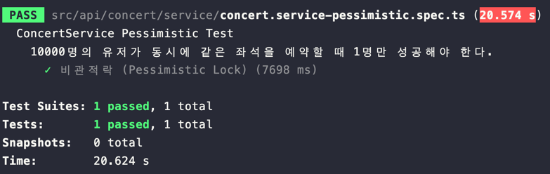

## 동시성 테스트 보고서

### 테스트 환경
```text
Apple M1 Pro 16GB 15.0.1(24A348)
```

### 테스트코드
낙관적락 테스트코드 : [concert.service-optimistic.spec.ts](../src/api/concert/service/concert.service-optimistic.spec.ts)

비관적락 테스트코드 : [concert.service-pessimistic.spec.ts](../src/api/concert/service/concert.service-pessimistic.spec.ts)

레디스락 테스트코드 : [concert.service-redis-lock.spec.ts](../src/api/concert/service/concert.service-redis-lock.spec.ts)

### 테스트 시나리오
```text
10,000명의 유저가 동시에 같은 좌석을 예약 시도
===> 1명만 성공해야 한다.
```

### 테스트 방법
```text
npm run test:optimistic &
psrecord $(pgrep -f "npm run test:optimistic") --interval 0.01 --plot test_optimistic_usage.png

npm run test:pessimistic &
psrecord $(pgrep -f "npm run test:pessimistic") --interval 0.01 --plot test_pessimistic_usage.png

npm run test:redis-lock &
psrecord $(pgrep -f "npm run test:redis-lock") --interval 0.01 --plot test_redis-lock_usage.png
```

### 테스트 결과

#### 낙관적락 (Optimistic Lock)
```text
테스트시간 : 3812ms

최대 CPU 사용량 : 약 230%

최대 MEM 사용량 : 약 70mb
```


#### 비관적락 (Pessimistic Lock)
```text
테스트시간 : 7698ms
        
최대 CPU 사용량 : 약 180%
        
최대 MEM 사용량 : 약 68mb
```




#### 레디스락 (Redis Lock)
```text
테스트시간 : 1440ms
        
최대 CPU 사용량 : 약 170%
        
최대 MEM 사용량 : 약 70mb
```


### 테스트 결과 요약

| 테스트 종류                  | 테스트 시간(ms) | 최대 CPU 사용량 | 최대 메모리 사용량 (MB) | 구현 난이도 |
|-------------------------|------------|------------|-----------------|--------|
| 낙관적락 (Optimistic Lock)  | 3812       | 약 230%     | 약 70 MB         | 중      |
| 비관적락 (Pessimistic Lock) | 7698       | 약 180%     | 약 68 MB         | 하      |
| 레디스락 (Redis Lock)       | 1440       | 약 170%     | 약 70 MB         | 상      |


### 결론
콘서트 예약시 발생할 수 있는 중복예약 방지를 위한 동시성 제어 방법 선택에 있어서

충돌 빈도가 많고 데이터의 정합성이 중요하므로

- 개발 시간이 충분하고 레디스 인프라가 있는 상황 -> 레디스락 사용
- 개발 시간이 부족하고 레디스 인프라가 없는 상황 -> 비관적락 사용

