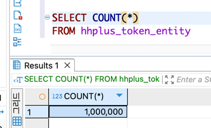
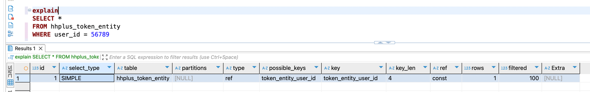

### 서비스에서 사용하고 있는 조회 쿼리

#### TokenRepository
```typescript
const token = await this.tokenRepository
  .findOne()
  .tokenValue({ tokenValue });

const existToken = await this.tokenRepository
  .findOne(mgr)
  .userId({ userId });
```

userId, tokenValue 조회 쿼리를 많이하므로 각각에 index 추가
```typescript
export class TokenEntity {
  ...
  @Index('token_entity_user_id')
  @Column({ type: 'int' })
  userId: number;

  @Index('token_entity_token_value')
  @Column({ type: 'varchar' })
  tokenValue: string;
 ...
}
```

**TokenEntity 10만개 데이터로 테스트**




### userId에 Index 적용 전


쿼리 실행 시간 : 평균 약 0.002s

실행 계획 분석

| 필드              | 값                   | 설명                                   |
|-----------------|---------------------|--------------------------------------|
| `id`            | 1                   | 단순 쿼리(단일 SELECT)                     |
| `select_type`   | SIMPLE              | 서브쿼리나 조인이 없는 단순 쿼리                   |
| `table`         | hhplus_token_entity | 조회하는 테이블                             |
| `partitions`    | null                | 파티션 사용 안 함                           |
| `type`          | ALL                 | 전체 테이블 스캔 (Full Table Scan), 성능 비효율적 |
| `possible_keys` | null                | 사용할 수 있는 인덱스 없음 (문제 발생)              |
| `key`           | null                | 사용된 인덱스 없음 (문제 발생)                   |
| `key_len`       | null                | 해당 없음                                |
| `ref`           | null                | 해당 없음                                |
| `rows`          | 99,645              | 쿼리가 거의 모든 행을 스캔 (비효율적)               |
| `filtered`      | 10.0                | 10%만 실제로 필터링 → 불필요한 행 검색 많음          |
| `Extra`         | Using where         | 인덱스 없이 WHERE 절로 필터링                  |


### userId에 Index 적용 후



쿼리 실행 시간 : 평균 약 0.057s

실행 계획 분석

| 필드              | 값                    | 설명                               |
|-----------------|----------------------|----------------------------------|
| `id`            | 1                    | 단순 쿼리(단일 SELECT)                 |
| `select_type`   | SIMPLE               | 서브쿼리나 조인이 없는 단순 쿼리               |
| `table`         | hhplus_token_entity  | 조회하는 테이블                         |
| `partitions`    | null                 | 파티션 사용 안 함                       |
| `type`          | ref                  | 인덱스를 사용한 조회, 성능 최적화됨             |
| `possible_keys` | token_entity_user_id | 사용할 수 있는 인덱스 존재                  |
| `key`           | token_entity_user_id | 사용된 인덱스 (`user_id` 인덱스 활용)       |
| `key_len`       | 4                    | 인덱스 검색에 사용된 키 길이 (4 바이트, INT 타입) |
| `ref`           | const                | `user_id = 56789` 조건이 상수로 사용됨    |
| `rows`          | 1                    | 조회되는 예상 행 수가 1개로 매우 적음 → 최적화됨    |
| `filtered`      | 100.0                | 필터링 효율이 높음, 모든 데이터가 유효           |
| `Extra`         | null                 | 추가적인 작업 없음, 최적화된 실행              |


### concertScheduleRepository
```typescript
const concertSchedules = await this.concertScheduleRepository
  .findMany()
  .concertId({ concertId });

const concertSchedule = await this.concertScheduleRepository
  .findOne()
  .concertIdAndTheDate({ concertId, theDateString });
```

concertId, (concertId, theDateString) 조회 쿼리를 많이하므로 각각에 index 추가
```typescript
@Entity()
@Index('concert_schedule_index', ['concertId', 'theDateString'])
export class ConcertScheduleEntity {
  ...
  @Index('concert_schedule_concert_id')
  @Column({ type: 'int' })
  concertId: number;

  @Column({ type: 'varchar' })
  theDateString: string;
  ...
}
```

10만건 데이터에 대해 테스트


### (concertId, theDateString) 복합 Index 적용 전

쿼리 실행 시간 : 평균 약 0.059s

실행 계획 분석


| 필드              | 값                              | 설명                                   |
|-----------------|--------------------------------|--------------------------------------|
| `id`            | 1                              | 단순 쿼리(단일 SELECT)                     |
| `select_type`   | SIMPLE                         | 서브쿼리나 조인이 없는 단순 쿼리                   |
| `table`         | hhplus_concert_schedule_entity | 조회하는 테이블                             |
| `partitions`    | null                           | 파티션 사용 안 함                           |
| `type`          | ALL                            | 전체 테이블 스캔 (Full Table Scan), 성능 비효율적 |
| `possible_keys` | null                           | 사용할 수 있는 인덱스 없음 (문제 발생)              |
| `key`           | null                           | 사용된 인덱스 없음 (문제 발생)                   |
| `key_len`       | null                           | 해당 없음                                |
| `ref`           | null                           | 해당 없음                                |
| `rows`          | 99,891                         | 쿼리가 거의 모든 행을 스캔 (비효율적)               |
| `filtered`      | 1.0                            | 매우 낮은 필터링 효율 → 불필요한 행 검색 많음          |
| `Extra`         | Using where                    | 인덱스 없이 WHERE 절로 필터링                  |


### (concertId, theDateString) 복합 Index 적용 후

쿼리 실행 시간 : 평균 약 0.002s

실행 계획 분석


| 필드              | 값                                                  | 설명                                 |
|-----------------|----------------------------------------------------|------------------------------------|
| `id`            | 1                                                  | 단순 쿼리(단일 SELECT)                   |
| `select_type`   | SIMPLE                                             | 서브쿼리나 조인이 없는 단순 쿼리                 |
| `table`         | hhplus_concert_schedule_entity                     | 조회하는 테이블                           |
| `partitions`    | null                                               | 파티션 사용 안 함                         |
| `type`          | ref                                                | 인덱스를 사용한 조회, 성능 최적화됨               |
| `possible_keys` | concert_schedule_concert_id,concert_schedule_index | 사용할 수 있는 인덱스 존재                    |
| `key`           | concert_schedule_index                             | 사용된 인덱스 (`concert_schedule_index`) |
| `key_len`       | 1026                                               | 사용된 키 길이 (VARCHAR 포함)              |
| `ref`           | const,const                                        | 두 개의 상수 값을 이용한 조회                  |
| `rows`          | 1                                                  | 조회되는 예상 행 수가 1개로 매우 적음 → 최적화됨      |
| `filtered`      | 100.0                                              | 필터링 효율이 높음, 모든 데이터가 유효             |
| `Extra`         | null                                               | 추가적인 작업 없음, 최적화된 실행                |


