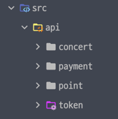
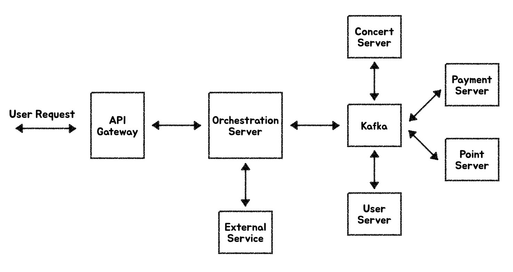

## 모놀리식 서비스를 MSA 형태로 분리 했을 때 한계점과 해결방안

### 1. 데이터 일관성과 분산 트랜잭션
- 마이크로서비스는 각 서비스별로 독립적인 DB를 가지므로, 데이터 일관성 유지가 어려움.
- 단일 트랜잭션을 사용할 수 없어서 분산트랜잭션을 사용해야 함.
  - 분산 트랜잭션을 사용하면 성능 저하와 복잡성이 증가함.
- **해결 방법:** SAGA 패턴, 보상 트랜잭션, CQRS 패턴 활용.

### 2. 분산 락 (Distributed Lock)
- 기존 모놀리식에서는 단일 DB의 트랜잭션 락을 사용하여 동시성 문제 해결 가능.
- MSA 환경에서는 여러 개의 서비스와 DB가 존재하므로 락을 분산 환경에서 적용해야 함.
- **해결 방법:**
    - Redis, ZooKeeper, Etcd 기반의 분산 락 적용.
    - 멱등성(idempotency) 및 재시도 메커니즘 도입.
    - Optimistic Locking & Pessimistic Locking 고려.

### 3. 메시지큐 (MQ)
- 서비스 간 비동기 통신을 가능하게 하여 성능과 확장성을 향상시킴.
- 높은 트래픽을 처리할 수 있도록 부하를 분산함.
- 서비스 간의 결합도를 낮춰 유연한 아키텍처를 제공함.
- 장애 발생 시 메시지 큐를 통해 데이터 유실을 방지하고 복구 가능하게 함.
- **활용 방법:**
    - 비동기 이벤트 처리 및 이벤트 소싱.
    - 트랜잭션 로그 처리 및 데이터 동기화.

### 4. 네트워크 복잡성 증가와 성능 저하
- 서비스 간 네트워크 호출 증가로 인해 레이턴시 증가.
- API 게이트웨이, 로드 밸런서 등의 추가 구성 필요.
- **해결 방법:**
    - gRPC, GraphQL 등의 통신 프로토콜 사용.
    - 캐싱 적용 (Redis, CDN 등).

### 5. 배포 및 운영 복잡성 증가
- 마이크로서비스는 독립 배포가 가능하지만, 서비스 간 종속성이 있어 관리가 어려움.
- 장애 발생 시, 원인 파악이 어려울 수 있음.
- **해결 방법:**
    - CI/CD 자동화 및 블루그린 배포, Canary 배포 적용.
    - 중앙 집중형 로깅 및 트레이싱 시스템 도입 (ELK, Prometheus + Grafana).

## 콘서트 예약 시스템을 MSA로 분리

### 도메인 목록

- concert
- payment
- point
- token

### Orchestration 패턴 사용

#### 콘서트 예약 성공 Flow
1. 유저가 좌석 예약 요청
2. OrchestrationServer가 `유저조회 이벤트` publish
3. UserServer가 `유저조회 이벤트` consume 후 `유저조회성공 이벤트` publish 
4. OrchestrationServer가 `유저조회성공 이벤트` consume 후 `좌석예약 이벤트` publish
5. ConcertServer가 `좌석예약 이벤트` consume 후 `좌석예약성공 이벤트` publish
6. OrchestrationServer가 `좌석예약성공 이벤트` consume 후 최종 response를 유저에게 전달

#### 콘서트 예약 실패 Flow
1. 유저가 좌석 예약 요청
2. OrchestrationServer가 `유저조회 이벤트` publish
3. UserServer가 `유저조회 이벤트` consume 후 `유저조회성공 이벤트` publish
4. OrchestrationServer가 `유저조회성공 이벤트` consume 후 `좌석예약 이벤트` publish
5. ConcertServer가 `좌석예약 이벤트` consume 후 이미 예약된 좌석이므로 `좌석예약실패 이벤트` publish  <-- 해당 단계에서 실패
6. OrchestrationServer가 `좌석예약실패 이벤트` consume 후 최종 response를 유저에게 전달

#### 예약된 좌석 결제 성공 Flow
1. 유저가 예약된 좌석 결제 요청
2. OrchestrationServer가 `유저조회 이벤트` publish
3. UserServer가 `유저조회 이벤트` consume 후 `유저조회성공 이벤트` publish
4. OrchestrationServer가 `유저조회성공 이벤트` consume 후 `예약된 좌석 상태를 결제완료로 변경 이벤트` publish
5. ConcertServer가 `예약된 좌석 상태를 결제완료로 변경 이벤트` consume 후 `예약된 좌석 상태를 결제완료로 변경 성공 이벤트` publish
6. OrchestrationServer가 `예약된 좌석 상태를 결제완료로 변경 성공 이벤트` consume 후 `포인트 차감 요청 이벤트` publish
7. PaymentServer가 `포인트 차감 요청 이벤트` consume 후 `포인트 차감 성공 이벤트` publish
8. OrchestrationServer가 `포인트 차감 성공 이벤트` consume 후 ExternalService에 좌석예약 정보 전송
9. 최종 Response를 유저에게 전달

#### 예약된 좌석 결제 성공 Flow
1. 유저가 예약된 좌석 결제 요청
2. OrchestrationServer가 `유저조회 이벤트` publish
3. UserServer가 `유저조회 이벤트` consume 후 `유저조회성공 이벤트` publish
4. OrchestrationServer가 `유저조회성공 이벤트` consume 후 `예약된 좌석 상태를 결제완료로 변경 이벤트` publish
5. ConcertServer가 `예약된 좌석 상태를 결제완료로 변경 이벤트` consume 후 `예약된 좌석 상태를 결제완료로 변경 성공 이벤트` publish
6. OrchestrationServer가 `예약된 좌석 상태를 결제완료로 변경 성공 이벤트` consume 후 `포인트 차감 요청 이벤트` publish
7. PaymentServer가 `포인트 차감 요청 이벤트` consume 후 포인트가 부족하여 `포인트 차감 실패 이벤트` publish <-- 해당 단계에서 실패했다고 가정
8. OrchestrationServer가 `포인트 차감 실패 이벤트` consume 후 `예약된 좌석 상태를 예약상태로 변경 이벤트` publish
9. ConcertServer가 `예약된 좌석 상태를 예약상태로 변경 이벤트` consume 후 `예약된 좌석 상태를 예약상태로 변경 성공 이벤트` publish
10. OrchestrationServer가 `예약된 좌석 상태를 예약상태로 변경 성공 이벤트` consume
11. 최종 Response를 유저에게 전달

