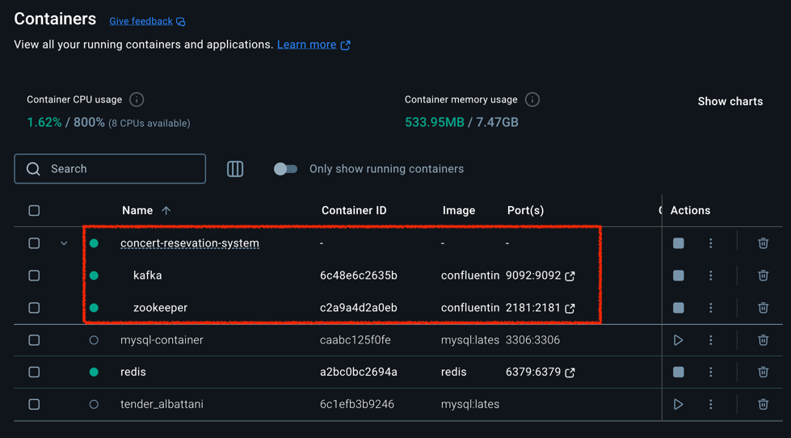
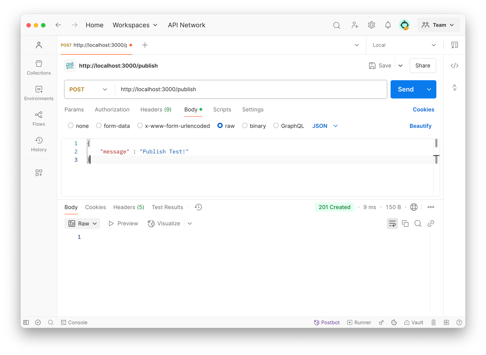
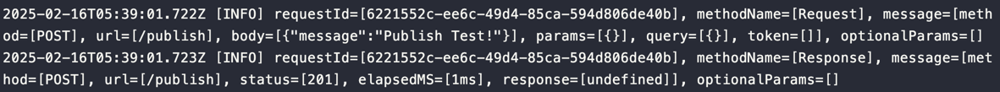
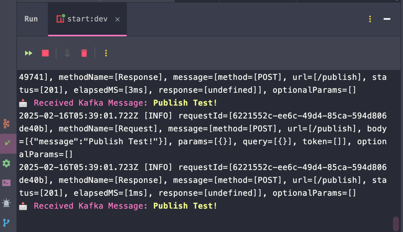

### Kafka docker-compose.yml
```yaml
services:
  zookeeper:
    image: confluentinc/cp-zookeeper:latest
    container_name: zookeeper
    environment:
      ZOOKEEPER_CLIENT_PORT: 2181
      ZOOKEEPER_TICK_TIME: 2000
    ports:
      - "2181:2181"

  kafka:
    image: confluentinc/cp-kafka:latest
    container_name: kafka
    ports:
      - "9092:9092"
    environment:
      KAFKA_BROKER_ID: 1
      KAFKA_ZOOKEEPER_CONNECT: zookeeper:2181
      KAFKA_ADVERTISED_LISTENERS: PLAINTEXT://localhost:9092
      KAFKA_OFFSETS_TOPIC_REPLICATION_FACTOR: 1
    depends_on:
      - zookeeper

```

```shell
docker compose up -d
```


### .env
```dotenv
MYSQL_HOST=127.0.0.1
MYSQL_CONNECTION_LIMIT=5
MYSQL_DATABASE=hhplus_concert
MYSQL_PASSWORD=1234
MYSQL_USER=root
MYSQL_PORT=3306

REDIS_HOST=127.0.0.1
REDIS_PORT=6379
REDIS_PASSWORD=NO_PASSWORD

KAFKA_BROKER=localhost:9092
KAFKA_CLIENT_ID=my-app
KAFKA_GROUP_ID=my-new-group
KAFKA_TOPIC=test-topic
```

### Kafka Producer
```typescript
class KafkaPublishTestDTO {
  message: string;
}

@Controller()
export class AppController {
  constructor(private readonly appService: AppService) {}

  @Post('/publish')
  publishMessageTest(@Body() body: KafkaPublishTestDTO) {
    return this.appService.publishMessageTest(body.message);
  }
}


@Injectable()
export class AppService implements OnModuleInit {
  constructor(
    @Inject('KAFKA_SERVICE') private readonly kafkaClient: ClientKafka,
    @Inject(KafkaConfig) private readonly kafkaConfig: KafkaConfig,
  ) {}

  async onModuleInit(): Promise<void> {
    await this.kafkaClient.connect();
  }

  async publishMessageTest(message: string) {
    this.kafkaClient.emit(this.kafkaConfig.topic, message);
  }
}
```

### Kafka Consumer
```typescript
@Controller()
export class AppKafkaConsumer implements OnModuleInit {
  constructor(
    @Inject('KAFKA_SERVICE') private readonly kafkaClient: ClientKafka,
  ) {}

  async onModuleInit() {
    await this.kafkaClient.connect();
  }

  @MessagePattern('test-topic')
  handleMessage(@Payload() message: string) {
    console.log(
      '\x1b[35m📩 Received Kafka Message: \x1b[1;33m%s\x1b[0m',
      message,
    );
  }
}
```

### Kafka Publish & Consume Test

#### Publish
- Postman


- Server-Log


#### Consume

